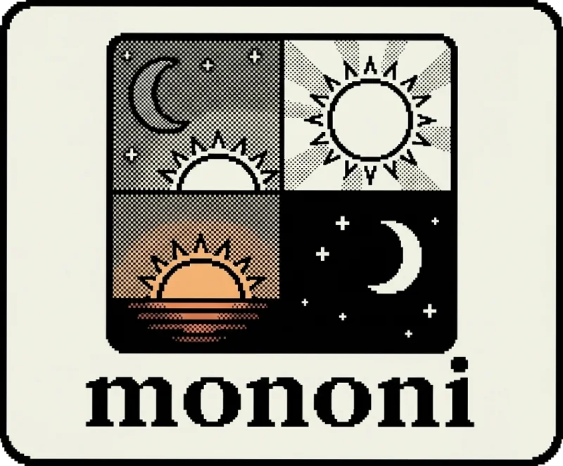

<p align="center">
  
</p>

<p align="center">
  Theme scheduler for macOS — <b>mo</b>rning, <b>no</b>on, and <b>ni</b>ght.
</p>

A Swift CLI daemon that automatically switches your Mac's appearance (light/dark) and wallpaper at configured times throughout the day. Ships with defaults for the four Tahoe aerials.

## Install

```
brew install bn-l/tap/mononi
```

Or build from source:

```
swift build -c release
cp .build/release/mononi /usr/local/bin/
```

## Usage

```
mononi start          # Install and start the launchd daemon
mononi stop           # Stop and uninstall the daemon
mononi status         # Show daemon status and current/next mode
mononi apply          # Apply the current mode immediately (no daemon needed)
mononi apply -m night # Apply a specific mode
mononi wallpapers     # List available wallpapers
mononi config show    # Print current config as JSON
mononi config set evening --time 18:00 --appearance dark --wallpaper "Tahoe Evening"
mononi config path    # Print config file location
mononi config reset   # Reset to defaults
```

## Default config

Stored at `~/.config/mononi/config.json`:

```json
{
  "modes": {
    "morning": { "startTime": "6:30",  "appearance": "light", "wallpaper": "Tahoe Morning" },
    "day":     { "startTime": "12:00", "appearance": "light", "wallpaper": "Tahoe Day" },
    "evening": { "startTime": "17:30", "appearance": "dark",  "wallpaper": "Tahoe Evening" },
    "night":   { "startTime": "21:00", "appearance": "dark",  "wallpaper": "Tahoe Night" }
  }
}
```

## How it works

The daemon runs as a launchd user agent (`com.mononi.agent`). On start and at each transition time it:

1. Sets appearance via `osascript` (AppleScript → System Events)
2. Writes the wallpaper selection to `~/Library/Application Support/com.apple.wallpaper/Store/Index.plist`
3. Restarts `WallpaperAgent` to pick up the change

### Supported wallpaper types

| Type | Location | Set via |
|------|----------|---------|
| Aerials (video) | `~/Library/Application Support/com.apple.wallpaper/aerials/videos/` | Plist with `com.apple.wallpaper.choice.aerials` provider + `assetID` |
| Static (.heic, .madesktop) | `/System/Library/Desktop Pictures/` | `NSWorkspace.setDesktopImageURL` |

Aerial names are matched against `accessibilityLabel` in the aerials manifest (`entries.json`). The video must be downloaded first (via System Settings > Wallpaper).

## Development notes

See [DEVLOG.md](DEVLOG.md) for the reverse-engineering journey behind programmatic aerial wallpaper switching on macOS Tahoe.
